# Grid Studies: Pure Data

Pure Data is... (INSERT HERE)

## Prerequisites

If you're very new to Java, here are some tutorials (...)

Download Pd Extended: [puredata.info/](http://puredata.info/downloads/pd-extended)

Download the monome installer: [monome.org/docs/begin](http://monome.org/docs/begin)

Download the grid-studies-pd repository: [github.com/monome/grid-studies-pd](https://github.com/monome/grid-studies-pd/archive/master.zip)

Inside the repository folder you'll find a `/files` directory which includes the example patches, plus an abstraction called `serialosc.pd`.

## 1. Connect

*See grid-studies-1-1.pd for this section.*

To communicate with grids we trade OSC messages with serialosc. serialosc translates OSC messages to streams of numbers over USB.

First we will show how to talk to serialosc.

Open Pd and start a new patch.

Save the blank patch to the `/files` folder as `study.pd`.

Create a new object (win/linux: control+1, mac: command+1) and type `serialosc` then place it in your patch with a mouse click.

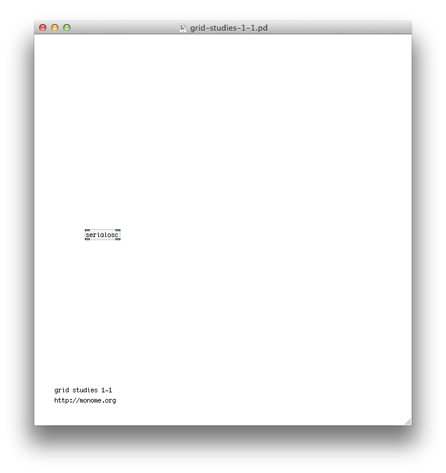

Attach your grid and you can now communicate with it through this object.

Note: this object you've imbedded isn't serialosc itself, which is an invisible daemon on your computer. The object is a helper patcher, or 'abstraction' to simplify using serialosc. We'll refer to this helper as serialosc, hopefully without much confusion.

The serialosc abstraction is actually the patch `serialosc.pd` inside an object. In order for your patch to use serialosc, the abstraction needs to be in the same folder as your saved patch, hence why we saved our patch to `/files` above.

## 2. Basics

Messages are sent to serialosc through the top left inlet, and received out the bottom left outlet.

*See grid-studies-2-1.pd for this section.*

### 2.1 Key input

To see what is coming from the grid, create a `print` object and connect the left outlet of serialosc to it. Open the Pd window (Window -> Pd Window) and press some keys on the grid. OSC data will be displayed in the console.

Examining the output, key data fits this form:

	/monome/grid/key x y state

Where x,y is the position and z indicates key down (1) or key up (0).

Other messages (such as connect and disconnect) come from this same outlet, so we want to filter for the key messages.

Change the `print` object to `routeOSC /monome/grid/key` and then print the output from the routeOSC.

We now have a list of 3 numbers according to each key action. Use an unpack to break this down further into individual numbers.

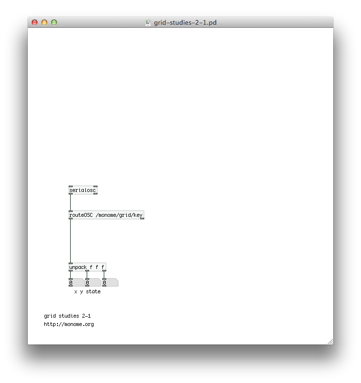

### 2.2 LED output

Above the serialosc box create a message (control/command + 2) and type:

	/monome/grid/led/set 2 0 1

Connect this to the left inlet of serialosc.

Clicking this box will light up LED 2 in row 0. The message format is:

	/monome/grid/led/set x y z

This is similar to the key input message, where z is on (1) or off (0).

Using Pd's list methods, use `$1 $2 $3` to change LEDs more dynamically. With a single message box as a sort of funnel, we can change various positions with message boxes and toggles.

To clear the entire grid, use the following message:

	/monome/grid/led/all 0

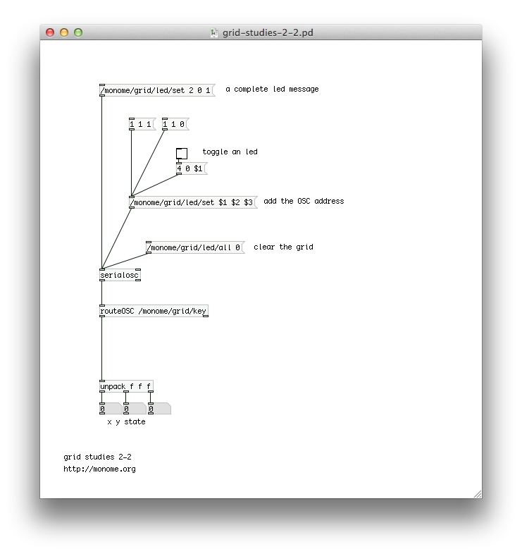

### 2.3 Coupled interaction

Connect the output of

	routeOSC /monome/grid/key

to the `/monome/grid/led/set $1 $2 $3` message box above serialosc which changes LEDs.

You now have a coupled interface, where the key state is reflected by the the LEDs.

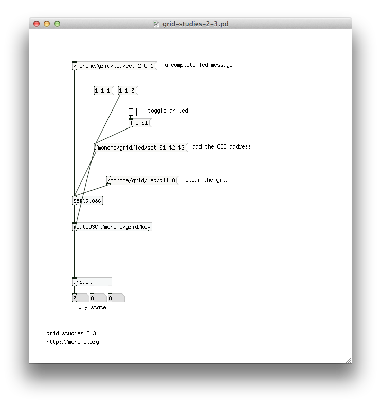

### 2.4 Decoupled interaction

The most fundamental decoupled interface is an array of toggles. We can accomplish this by ignoring the key up state, switching the LED state only on key down.

We'll start with a single toggle for the upper left key position (0, 0).

Remove the connection between routeOSC and the LED-driving message box.

To respond to the 0,0 position, we can use two `route` objects to filter the x, then y location of the press. Then we can respond only to key down by looking for values of 1 with a `sel` object.

	route 0
	
	route 0
	
	sel 1

Connect the output from the sel into a toggle box (control/command + shift + T). You can now see the toggle reflect the toggle state by pressing the upper-left key on the grid.

To complete the cycle we can then drive the corresponding LED with a message box `/monome/grid/led/set 0 0 $1` connected to serialosc's left inlet.

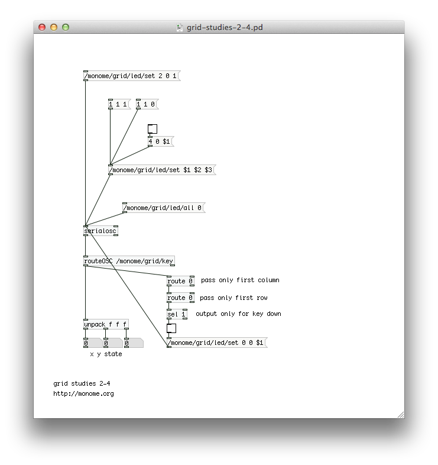

## 3.0 Further

Now we'll show how basic grid applications are developed by creating a step sequencer. We will add features incrementally:

- Use the top six rows as toggles.
- Accept a clock pulse to advance the playhead from left to right, one column at a time. Wrap back to 0 at the end.
- Display the play head on "position" (bottom) row.
- Indicate the "activity" row (second to last) with a low brightness.
- Trigger an event when the playhead reads an "on" toggle. Our "event" will be to turn on the corresponding LED in the "activity" row.
- Jump to playback position when key pressed in the position row.
- Adjust playback loop with two-key gesture in position row.

### 3.1 Toggles

*See grid-studies-3-1.pd for this step.*

Before we can make our bank of toggles, we need a way to look at the top six rows only, as the last two rows are not part of our toggle bank. First we'll use a message box to switch around our key input to place the row number first, then route off the last two rows for use later.

	$2 $1 $3
	
	route 6 7

By switching the first and second elements and then putting them into the route object, rows 0-5 are passed to the right outlet.

In our previous example we only created a single toggle, and the chosen approach is not appropriate for dealing with a large bank of toggles. Instead we'll create a `table` which functions as a large array of data for remembering the toggle states of the top six rows. Our table is inside the subpatcher `pd toggles`.

Note how after formatting the LED messages from `pd toggles` we use a `s osc-out` to send osc messages to serialosc without cluttering our patch with long patch connections.

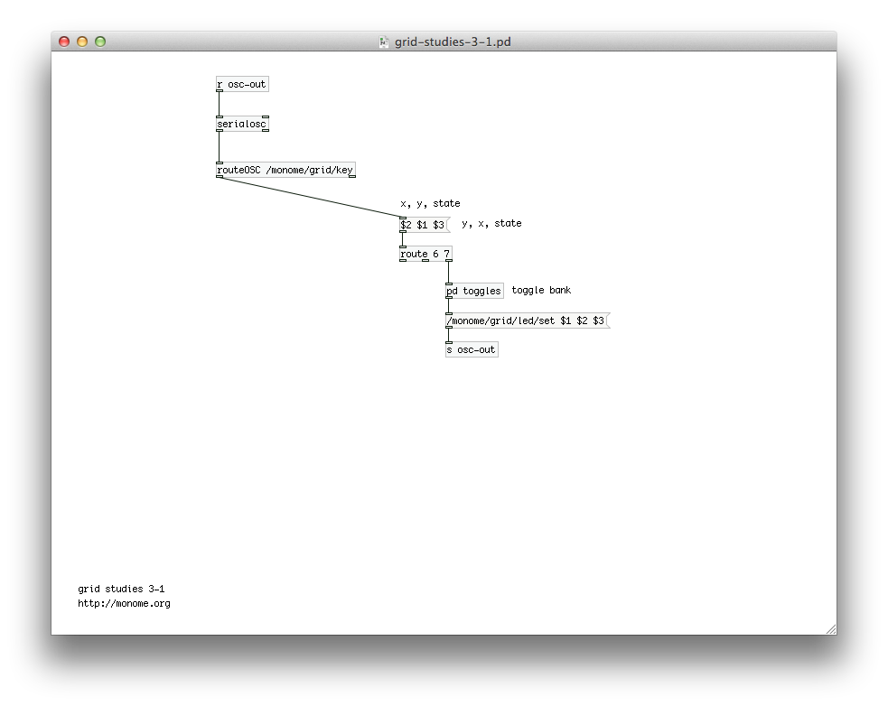

The toggles sub-patch can be broken down into a number of small steps to understand it, though don't fret if it doesn't make total sense immediately. This sub-patch can simply be copied to your own projects without modification and it will work for the full 16x8 grid.

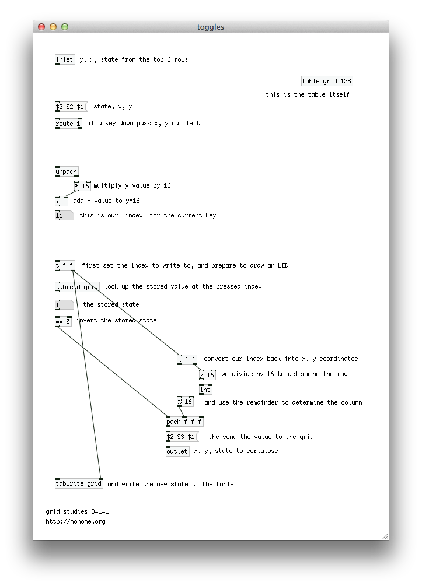

In order to save the state of the bank of toggles we create a table called 'grid' with 128 values.

	table grid 128
	
Rearranging the input key press information we can ignore key-ups as before. Inline comments track the current order of our input message.

	$3 $2 $1
	
	route 1
	
In order to put our 2-dimensional grid into a table, we have to 'flatten' it into a long list. We do so by multiplying the y value by 16, and adding the result to our x value. The grid is thus read like a book, from left to right, starting at the top and working downward.

	unpack
	|	|
	|	* 16
	| /
	+
	
This index value is then used to set two values before toggling that state. The index is converted back to the x,y coordinate for LED feedback, plus we save the index to update the table with our new toggle state.

Finally we use the index to find the current state of the table, then invert that state with '== 0'. This works because our state is always a 0 or 1. This value is then sent to update the grid LED and is stored back in the table.

### 3.2 Play

*See grid-studies-3-2.pd for this step.*

We can create a "play head" with a simple counter.

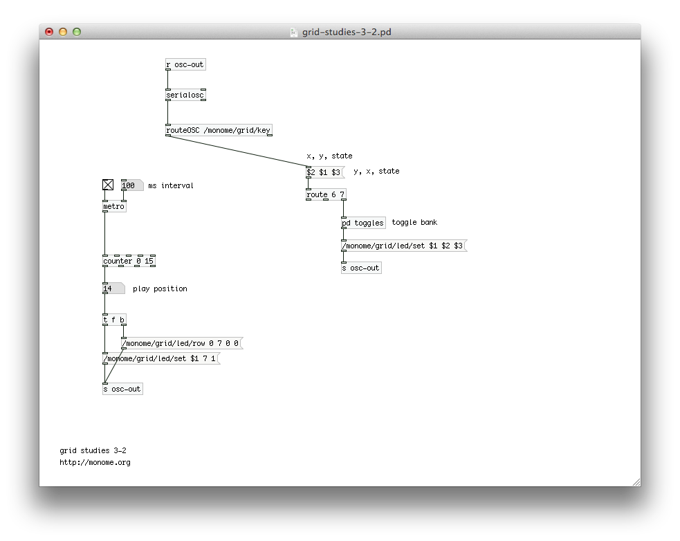

To see the play position on the bottom row, we will turn on the corresponding LED position after first clearing the entire row. We can clear a row by using a new OSC message:

	/monome/grid/led/row 0 7 0 0

where the format of the message is:

	/monome/grid/led/row x_offset y d[...]

Here y is 7, the last row. Check out the full OSC spec for more information on this message.

After we clear the row, we turn on the corresponding LED with a normal single-LED message:

	/monome/grid/led/set $1 0 1

Now when you turn on the clock, you'll see the playhead moving along the bottom row.

### 3.3 Triggers

*See grid-studies-3-3.pd for this step.*

As the playhead moves we will read the contents of the corresponding column and trigger events based on which toggles are turned on.

We do this by scanning through our table, looking at every 16th value, driven by the play position. The `pd triggers` sub patch shows how to read data out of the table we created in `pd toggles`.

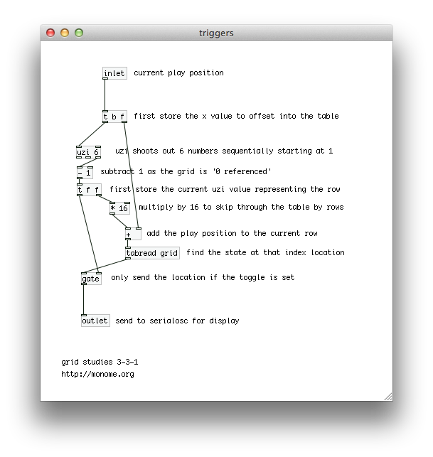

Using the uzi object we read the state of the toggle for each subsequent row, by multiplying the uzi output by 16 (to jump through the array by rows), and adding the current play position to point at the correct column of data. Note that we subtract one from uzi's right outlet as the grid is indexed from zero, whereas uzi starts counting from one. If the discovered value is 1 we send out the row value to indicate an "event" has occured.

To indicate these "events" we will light up the corresponding x position in the 6th row:

	/monome/grid/led/set $1 6 $2

Similarly to the play position display, we need to clear the row between refreshes.

Furthermore, to give the interface some delineation (not just a field of random LEDs) we will "clear" this row to a low-brightness level rather than completely off:

	/monome/grid/led/level/row 0 6 5 5 5 5 5 5 5 5 5 5 5 5 5 5 5 5

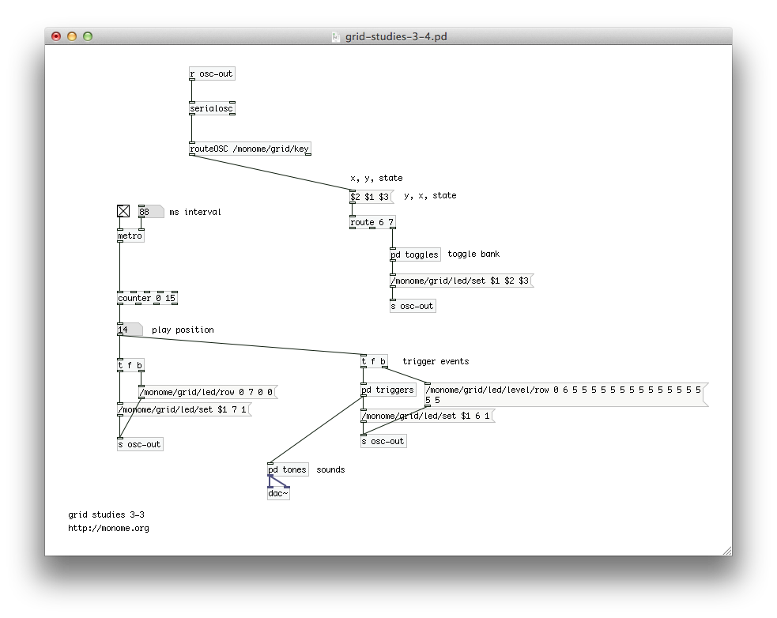

This /level/ message is in the format:

	/monome/grid/led/level/row x_off y d[...]

The format is similar to the monochromatic `row` message, but here `d[...]` is discrete LED values of 0-15. The message we're using has 16 of the number 5, which sets the entire 6th row to a dim level.

The "triggered" LEDs will be full brightness on top of this dim row.

Lastly, there's a tiny sound engine so you can actually hear something. Turn on the DAC and turn up the gain slider.

### 3.4 Cutting and Looping

*See grid-studies-3-4.pd for this step.*

To liven up the sequencer, we will have key presses on the play row jump to the pressed position. But we also want a two-key gesture (holding down a first while pressing a second) to set the start-end loop boundaries. This requires keeping track of how many keys are being held down in the last row.

Inside `pd cutting` we process all presses from the last row, and send our commands to the counter object.

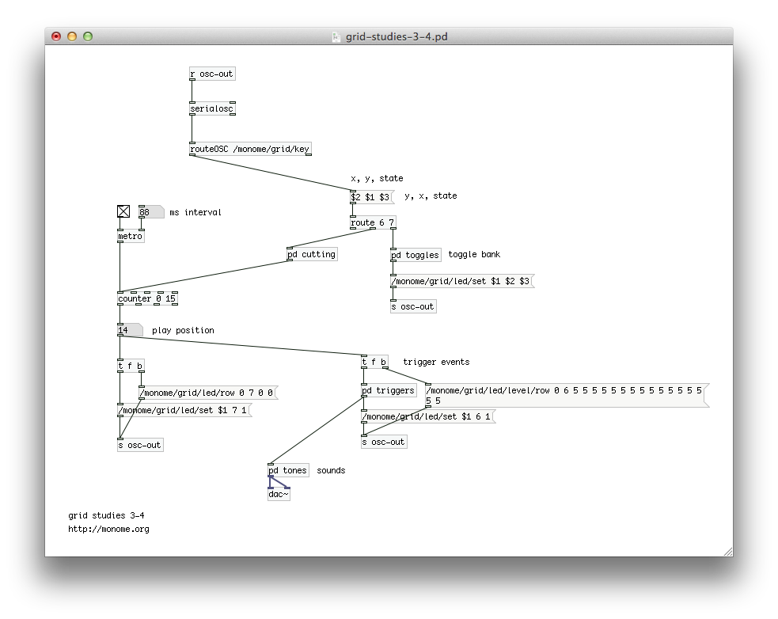

We unpack the incoming message and keep track of the accumulation of key ups and downs. This is accomplished by adding one for each key up and subtracting one for each key down. This looks weird as a pd patch, but tracing through it will reveal the logic.

The number of keys held will gate the output of the x position of the key. When a single key is pressed the x position goes out the left outlet of the gate, setting the position of the counter. This first position is also stored for potential use later.

If a second key is pressed (in this same row) while a first is held, the current x position pressed is set as the loop max (with a `max $1` message) and the previously pressed x position is recalled and set as the loop minimum (with a `min $1` message).

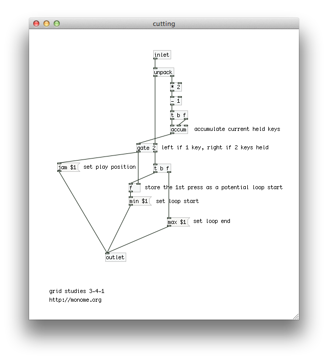

## Closing

We've created a minimal yet intuitive interface for rapidly exploring sequences. We can intuitively change event triggers, loop points, and jump around the data performatively. Many more features could be added, and there are numerous other ways to think about interaction between key press and light feedback in completely different contexts.

### Suggested exercises

- Display the loop range with dim LED levels.
- "Record" keypresses in the "trigger" row to the toggle matrix.
- Display the play head position as a dim column behind the toggle data.
- Use the rightmost key in the "trigger" row as an "alt" key.
	- If "alt" is held while pressing a toggle, clear the entire row.
	- If "alt" is held while pressing the play row, reverse the direction of play.
